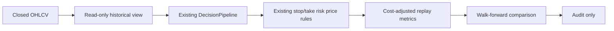

# Top20 Technical Validation Design

## Decision

This validation slice compares the existing one-hour directional baseline with the current automatic directional policy: `4h trend -> 1h state -> 15m entry -> 1m protection`. It does not enable `operator_experience_4h_15m_v1`, alter a PaperRun, submit an order, or change a Testnet setting.

## Boundaries

| Component | Responsibility | Non-goal |
|---|---|---|
| `TechnicalStrategyValidationService` | Replay closed historical bars through the existing decision and risk-price logic; calculate gross and net metrics; produce OOS windows. | It cannot write a strategy, PaperRun, risk profile, or gateway order. |
| Validation script | Load/backfill Top20 OHLCV, construct the two read-only strategy contracts, and write one audit report. | It cannot promote a strategy or mutate runtime configuration. |
| Audit report | Record sample period, coverage, signal density, net expectancy, cost share, drawdown, walk-forward windows, and failed gates. | It is not a BacktestRun admission or a substitute for Paper evidence. |

## Data and Flow

The historical view exposes only bars at or before the replay timestamp. Costs are deducted on both entry and exit. Missing timeframe coverage, insufficient warmup, or failed validation gates yields a non-promotable result.

## Strategy Contracts

- Baseline: the validated one-hour directional contract, reconstructed from the historical mature-template settings.
- Candidate: the current automatic directional contract with 4h/1h/15m responsibilities, reconstructed from the active template settings.
- The legacy `operator_experience_4h_15m_v1` remains a disabled research record and is not a candidate in this slice.

## Promotion Evidence

The report is informative only. A later promotion review needs all of the following: positive OOS net expectancy, at least 20 percent expectancy improvement over baseline, validation thresholds, complete data coverage, and the existing 90-day / 100-trade Paper evidence gate from ADR-023.

## Verification

Run targeted replay tests first, then the repository Python test, Ruff, and mypy gates. Run the report against real stored or backfilled Top20 data only after the local validation tests pass.

## Non-goals

- No automatic strategy enablement.
- No Testnet or Mainnet execution.
- No change to the exit ladder, signal fusion, correlation gate, or reconciliation cadence in this slice.
