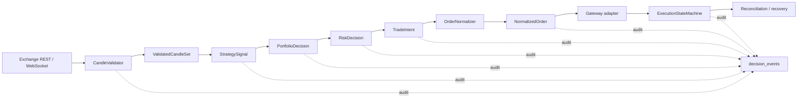

# Trading System Correctness Audit

Date: 2026-07-20

## Safety boundary

- Mainnet remains disabled.
- Automatic exchange execution remains disabled by default (`BINANCE_AUTO_EXECUTE=false`).
- No Binance Simulation order or scheduler restart was performed during this refactor.
- Existing Paper risk values were not changed.

## Evidence-backed findings

| Priority | Finding | Evidence | Remediation |
|---|---|---|---|
| P0 | Runtime configuration had multiple writers and five manifest/database field drifts | `services/execution/bootstrap.py`, `PATCH .../auto-settings`, `PATCH .../execution-profile`, runtime sync audit | Immutable `trading_config_snapshots`, SHA-256, optimistic concurrency, active/pending pointers; bootstrap no longer overwrites persisted rules |
| P0 | Execution semantics were hidden in `entry_context` and free strings | `shared/models/workflow.py::ExecutionOrderRequest`, `services/execution/gateway.py` | Added immutable `TradeIntent`, `NormalizedOrder`, `ExecutionReport`, explicit action/position/exchange side and controlled state enum |
| P0 | Hedge-mode close could not be proven safe from the common order contract | Binance mapping in `services/execution/gateway.py` | Added one-way/hedge normalization matrix; hedge closes require confirmed position quantity and omit `reduceOnly` |
| P1 | Decision rejection history was primarily a mutable projection | `DecisionSnapshot`, PaperRun metrics | Added append-only `decision_events`, uppercase `BlockCode`, idempotent open-decision key and redacted payloads |
| P1 | REST candle closure was not expressed as a shared proof | Decision pipeline and data normalization paths | Added exchange-server-time closure, UTC/duration/gap/freshness validation and cross-symbol close-time alignment |
| P1 | Optional pandas-ta binary failure prevented test collection | `pandas_ta_adapter.py` importing `llvmlite.dll` | Treat `ImportError` and binary-loader `OSError` as an unavailable optional dependency |
| P2 | Uvicorn custom loop string no longer matched the installed typed/runtime API | `apps/api/local_server.py` | Use supported `asyncio` loop after installing Windows selector policy |

## Current data and execution chain

## Configuration precedence after migration

1. Active database `trading_config_snapshots` row and its hash.
2. Pending snapshot, visible but effective only at its declared cycle boundary.
3. Code templates seed missing records only and never overwrite persisted strategy rules.
4. Manifest remains admission evidence, not a mutable runtime configuration writer.
5. Environment variables contain process safety switches and credentials only; credentials are rejected from snapshots.

## Remaining integration work

- Convert every legacy Paper/manual/carry gateway entry to `TradeIntent` and remove executable reliance on `entry_context`.
- Feed `CandleValidator` through every REST and WebSocket strategy path.
- Persist state-machine transitions for existing orders and add the Binance user-data-stream consumer.
- Wire recovery-check and order-timeline projections into the API/console.
- Implement and validate `trend_pullback_v1` only in Replay/Shadow; do not modify the active manifest before OOS gates pass.
- Run full SQLite and PostgreSQL migration verification plus the final full-suite/frontend/pre-commit gates.
