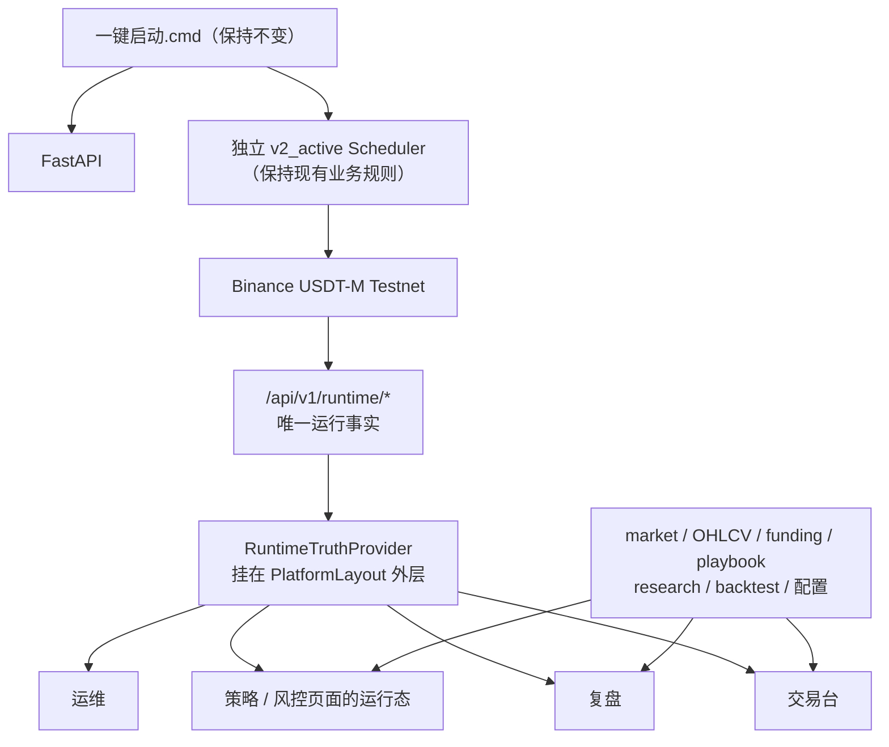

# 前端 Runtime Truth 收口：冻结方案与实施合同

**合同版本：** 1.0
**合同状态：** `READY_FOR_PROMPT3_PREFLIGHT`
**冻结日期：** 2026-08-11
**权威本地基线：** `backup/2026-08-10-wip@4029e7f19f3ffd488d4f6973cc4797865ef17b2d`
**历史对照：** `720a36e → 4029e7f` 仅增加只读研究包；它不改变本合同的 Active Runtime 主链。
**本阶段权限：** 仅冻结本文件与 `execution-manifest.yaml`；不得修改业务代码、提交或推送。

## 1. 决策与边界

唯一批准的方向是 **方案 B：以现有 Runtime Truth 作为唯一运行真相，完成前端迁移**。这不是重写前端，也不是新增第三套状态架构。

运行事实（账户、仓位、交易所订单、决策、调度、对账、保护、LLM journal）只允许来自 `/api/v1/runtime/*`，并由一个常驻的 `RuntimeTruthProvider` 分发。市场快照、OHLCV/K 线、funding、策略 playbook、研究资料、回测及风控配置仍然保留各自业务 API；“统一运行事实”不等于制造一个超级接口。

下列路线明确禁止：

- 方案 A：继续让 `useConsoleData`、`useAutomatedTradingRuntime`、`binance-testnet-account` 在交易台混合充当真相。
- 方案 C：重写整个前端、重做已可用的交易/研究/策略/验证功能。
- 把中文化、K 线、复盘、Ops 或全站页面状态推迟到“下一轮优化”。P-001 至 P-008 均属于本次收口目标，只按依赖顺序执行。



## 2. 冻结的问题编号

| 编号 | 根因 | 一次收口的现象 | 不可退让的结果 |
| --- | --- | --- | --- |
| P-001 | V1/V2/Testnet 三套交易真相并存 | 状态矛盾、字段错接、假 0 | 运行事实只走 Runtime Truth |
| P-002 | 页面与请求生命周期错误 | 切页白屏、慢请求重叠 | Provider 常驻、single-flight、可取消请求 |
| P-003 | UI 高频探测重型 legacy Testnet account | 余额慢、后台被拖慢 | 账户摘要进入 Runtime exchange snapshot；旧接口退出 Active UI 链 |
| P-004 | Loading/Empty/Error/Stale 无统一模型 | “暂无数据”掩盖失败或未加载 | 五态数据状态，未知绝不伪装成 0/正常 |
| P-005 | Review/Ops 未迁移当前主链 | 有交易事实但复盘/运维为 0 或 unknown | 当前运行复盘与历史知识库分层；Ops 读 Runtime Truth |
| P-006 | 无统一中文展示层 | 协议枚举和内部字段裸露 | `format.js` 集中映射七个主导航页面及直接共享组件 |
| P-007 | 交易页 CSS 双体系和信息层级失衡 | 巨大 K 线、首屏看不到记录入口、黑白割裂 | Binance-inspired 浅色工作台、K 线/Tab 首屏合同 |
| P-008 | 只验证 Mock/组件而非用户行为 | 测试绿但一键启动后失效 | 业务断言、真实浏览器、独立只读审查和外部验收合同 |

## 3. 不变量与禁止范围

本合同不授权改变任何交易决策或执行业务行为。以下路径、规则和边界均为 `MUST_NOT_CHANGE`：

- `services/automated_trading/domain/**`
- `services/automated_trading/application/decision_service.py`
- 策略生成、开仓/平仓判定、仓位算法、Gatekeeper、保护单业务逻辑、V2 execution mode、scheduler 周期业务逻辑
- 数据库 migration、依赖和 lock 文件
- `一键启动.cmd`、默认 `v2_active` 模式、`LIVE_TRADING_ENABLED=false`、Testnet/Mainnet 安全边界、已有 Testnet 开平单主链
- `services/execution/gateway.py` 的 `submit_order`、杠杆、止盈止损、平仓及任何写入交易所的规则

`gateway.py` 在 E-001 的唯一许可是**读取/对账账户摘要**：不能改写交易、不能发送验收订单，不能改变默认自动调度调用的行为。

## 4. 固定接口与状态合同

### 4.1 Runtime exchange snapshot

`GET /api/v1/runtime/snapshot` 中 `exchange.value.account` 增加以下**数值型**字段：

```json
{
  "wallet_balance": 12345.67,
  "available_balance": 12000.00,
  "margin_balance": 12310.42,
  "unrealized_pnl": -35.25,
  "open_position_count": 2
}
```

字段没有可确认值时，外层 Runtime datum 必须以 `UNAVAILABLE` 或 `STALE` 表达，不能用 `0` 代替。`open_position_count` 是账户摘要的一部分，不能从未知 `positions` 推导为 0。

账户采集复用已有 exchange probe 的 **15 秒缓存、8 秒硬超时、单 probe lock、stale fallback**。`gateway.reconcile()` 仅增加一个默认关闭的账户摘要选项（例如 `include_account_summary=False`）；未启用该选项的现有自动调度调用必须保持回归等价。账户字段由现有 `sync_account()` 的只读交易所数据构成，随同同一个 exchange truth 返回；不得创建独立 UI probe。

### 4.2 前端运行事实和请求生命周期

`RuntimeTruthProvider` 位于 `QueryClientProvider` 之内、`PlatformLayout`/路由 `Outlet` 之外，维护全站唯一的 Runtime REST + WebSocket 链。页面只可读取、筛选或展示 Provider 状态；不得各自新建运行真相轮询。交易页从 Active 链移除：

- `useAutomatedTradingRuntime()` 作为运行真相；
- `fetchPositions()` 的额外运行真相请求；
- `/execution/binance-testnet-account` 的 mount/8 秒/15 秒周期请求；
- legacy overview 的 orders 作为真实交易所订单。

`request()` 必须原样透传 `AbortSignal`。`AbortError` 是取消，不得变换为“服务暂时不可用”；其他真实网络错误仍须带明确失败状态。

`useConsoleData` 的每个 selection 在任意时刻至多一个 refresh in-flight：定时器到期后等待本轮 `refresh()` 完成，再计算并安排下一次；币种切换（例如 BTC→ETH）与卸载必须中止旧 market 请求。不可取消的普通 fetch 保留兼容，但所有 selection-sensitive 正式调用纳入该契约。

### 4.3 数据状态和 readiness

共享 `DataState` 固定为：`LOADING`、`AVAILABLE`、`STALE`、`UNAVAILABLE`、`EMPTY`。

- 首次尚未返回：保留页面壳、Tab 和 skeleton/“正在读取”，不是空态。
- 成功返回空集合：才显示“暂无记录”。
- 后台刷新：保留上一次有效值，显示更新时间和“正在刷新”。
- 失败且无数据：显示原因和重试；有缓存但探测失败：`STALE`。
- 风控 unknown 只能展示“状态待确认”，绝不映射为“正常”。
- 进程 readiness 与业务 readiness 分层：启动器仍只管 API、Scheduler、前端可达；页面分别表达自动交易引擎、市场、币安模拟盘和账户数据的准备/正常/延迟/不可用。

### 4.4 中文展示层与视觉合同

`frontend/admin/src/utils/format.js` 扩充既有展示职责，集中承载显式枚举、字段名和布尔映射；不得新建第三套 i18n 文件。至少覆盖：

| 协议值 | 用户展示 |
| --- | --- |
| `pending` | 待处理 |
| `healthy` | 正常 |
| `degraded` | 异常/降级 |
| `configured` / `missing` | 已配置 / 未配置 |
| `long` / `short` | 做多 / 做空 |
| `ACTIVE` | 已启用 |
| `BINANCE_TESTNET` | 币安模拟盘 |
| `true` / `false` | 是 / 否 |

字段名至少覆盖 `execution_engine`、`optimization_method`、`implementation_status`、`scheduler_error`、`next_cycle_eta_seconds`、`risk_profile`、`operator_risk_per_trade`、`generic_risk_profile_max_leverage`。BTC、ETH、SOL、Binance、GitHub 仓库名、LLM、RAG、API、MACD、RSI、EMA、ADX、VWAP、Sharpe、Freqtrade、Hyperopt、外部模型名和源码路径保持专业原名。

视觉方向固定为现有 Binance-inspired **浅色**工作台。K 线高度固定采用：

```css
height: clamp(280px, 38vh, 420px);
min-height: 280px;
```

在 900p 与 1080p 桌面高度，首屏无需滚过完整一屏即可看到账户状态、K 线以及持仓/订单/决策记录 Tab。长记录仅在内容区域内部滚动；清除相互覆盖的双重深浅主题和超大 `min-height`，深色仅限 tooltip、图表局部或风险警告。

## 5. 文件范围

### 必改集合（实施阶段）

| 组 | 文件 |
| --- | --- |
| Runtime Truth | `apps/api/routers/runtime.py`；`services/execution/gateway.py`；`frontend/admin/src/hooks/useRuntimeTruth.js`；`frontend/admin/src/pages/PaperConsole.jsx`；`frontend/admin/src/components/TradingSummaryHero.jsx` |
| 请求/状态生命周期 | `frontend/admin/src/hooks/useConsoleData.js`；`frontend/admin/src/api/client.js`；`frontend/admin/src/router.jsx`；`frontend/admin/src/components/Common.jsx` |
| 顶部业务页面 | `frontend/admin/src/pages/ReviewCenter.jsx`；`OpsConsole.jsx`；`StrategyLibrary.jsx`；`RiskConsole.jsx`；`ValidationCenter.jsx`；`ResearchDesk.jsx` |
| 展示/布局 | `frontend/admin/src/utils/format.js`；`frontend/admin/src/styles.css` |
| 既有测试优先扩展 | `frontend/admin/src/hooks/useRuntimeTruth.test.jsx`；`useConsoleData.test.jsx`；`frontend/admin/src/pages/PaperConsole.deskSync.test.jsx`；`OpsConsole.test.jsx`；`frontend/admin/src/components/TradingSummaryHero.test.jsx`；`tests/api/test_runtime_truth_api.py` |

允许在上述测试同目录增加仅为 T-001～T-009 所需的测试文件；必须先在 manifest 的 `planned_new_test_files` 声明。详情路由和其非直接共享组件不属于本轮中文化范围。

## 6. 严格实施顺序

每项先写红灯，再以最小 diff 通过焦点回归；未满足本项 `diff gate` 不得开始下一项。任何任务触及禁止范围立即停止，恢复到只读诊断并报告。

### E-001 — Runtime exchange truth 补齐账户摘要

- **问题：** P-001、P-003、P-004。
- **MUST_CHANGE：** `apps/api/routers/runtime.py`、`services/execution/gateway.py`、`tests/api/test_runtime_truth_api.py`。
- **MAY_CHANGE：** 仅为请求/响应模型所必需的同模块测试辅助代码。
- **MUST_NOT_CHANGE：** 全部执行写路径、默认 `gateway.reconcile()` 调用语义、自动调度业务规则。
- **红灯：** snapshot exchange 可用时缺少数值型账户字段；账户 probe 超时且有缓存时未返回 stale；默认 `reconcile()` 被额外调用账户 API。
- **业务断言：** `include_account_summary` 默认关闭；开启时共享现有 cache/timeout/lock/stale fallback；`wallet_balance`、`available_balance`、`margin_balance`、`unrealized_pnl`、`open_position_count` 均明确类型与 unavailable 语义。
- **diff gate：** `gateway.py` 只能出现 read/reconcile account-summary 相关变更；不得出现 `submit_order`、close、leverage、protection 变更。

### E-002 — PaperConsole 切换唯一 Runtime Truth

- **问题：** P-001、P-003、P-004。
- **MUST_CHANGE：** `PaperConsole.jsx`、`TradingSummaryHero.jsx`、`useRuntimeTruth.js`、对应 PaperConsole/Hero 测试。
- **MAY_CHANGE：** 直接渲染的 trading 子组件，仅为 Runtime datum 适配。
- **MUST_NOT_CHANGE：** 交易下单控件、策略/风控决策、legacy API 本身的兼容保留。
- **红灯：** Runtime snapshot 返回账户/仓位/订单时，交易页仍请求 `/execution/binance-testnet-account`、`/api/v2/automated-trading` 或额外 positions；exchange unavailable 仍渲染 0、`+0.00`、正常。
- **业务断言：** Hero 的账户、持仓、订单、决策、对账、scheduler 都从 Runtime Truth；遗留 hook 可以保留但核心页面不得消费为运行真相。
- **diff gate：** PaperConsole 运行事实 imports/请求仅允许 Runtime Truth；市场/K 线/手动交易上下文仍可来自 `useConsoleData`。

### E-003 — single-flight、AbortController 与路由外持久化

- **问题：** P-002。
- **MUST_CHANGE：** `useConsoleData.js`、`api/client.js`、`router.jsx`、`useRuntimeTruth.js`、相关 hook/页面测试。
- **MAY_CHANGE：** `Common.jsx` 中 Provider 需要的最小容器。
- **MUST_NOT_CHANGE：** 业务 API payload、路由 URL、定时调度业务逻辑。
- **红灯：** 60 秒 pending 请求时 30 秒触发第二次调用；BTC→ETH 后 BTC 不被 cancel；AbortError 显示服务故障；交易→复盘→交易第一帧丢失最后有效余额。
- **业务断言：** `RuntimeTruthProvider` 常驻 `PlatformLayout`；REST/WS 全站共享；一轮完成后才 schedule next；页面切换立即呈现 cache 再后台刷新。
- **diff gate：** 任何 Abort 错误必须被识别为取消，不能被统一错误包装器转换。

### E-004 — 统一 DataState 与 readiness

- **问题：** P-004。
- **MUST_CHANGE：** `Common.jsx`、`TradingSummaryHero.jsx`、`PaperConsole.jsx`、`useRuntimeTruth.js`、状态相关测试。
- **MAY_CHANGE：** 七个主导航页面直接使用的共享展示组件。
- **MUST_NOT_CHANGE：** 后端交易状态枚举协议、默认风控判断、启动入口。
- **红灯：** Promise 未完成即为“暂无数据”；unknown risk 为“正常”；无账户数据仍为持仓 0/PnL 0。
- **业务断言：** 实现 LOADING/AVAILABLE/STALE/UNAVAILABLE/EMPTY，且空态仅来自已成功响应；分层 readiness 不阻塞非交易页。
- **diff gate：** 全局风险未知没有默认安全映射。

### E-005 — Review 与 Ops 对齐 Runtime Truth

- **问题：** P-005、P-004、P-006。
- **MUST_CHANGE：** `ReviewCenter.jsx`、`OpsConsole.jsx`、`useRuntimeTruth.js`、相应测试。
- **MAY_CHANGE：** `Common.jsx`、`format.js` 的直接展示支持。
- **MUST_NOT_CHANGE：** `/reviews`、`/failures`、`/decision-memory` 和 `/execution/trading-status` 的后端兼容接口。
- **红灯：** `/reviews=[]`、`/failures=[]` 而 `/runtime/decisions` 有五项时复盘页面仍然“五个 0”；Ops 与交易台对同一 scheduler/exchange 表达互相矛盾。
- **业务断言：** Review 分为“当前自动交易复盘”（决策、订单、仓位变化、对账、LLM、异常）和标明用途的历史知识库；Ops 的 scheduler/exchange/reconciliation/freshness/blocked symbols/latest orders 读取 Runtime Truth，其他 Ops 信息仍用自己的业务 API。
- **diff gate：** 页面进入不得把只读数据解释为没有当前活动。

### E-006 — Strategy、Risk、Validation、Research 页面状态

- **问题：** P-004、P-005、P-006。
- **MUST_CHANGE：** `StrategyLibrary.jsx`、`RiskConsole.jsx`、`ValidationCenter.jsx`、`ResearchDesk.jsx` 及其必要测试。
- **MAY_CHANGE：** 直接共享 `Common.jsx`/`format.js`。
- **MUST_NOT_CHANGE：** 策略、回测、验证、研究计算或后端刷新调度。
- **红灯：** `undefined` 经 `asArray` 被立即渲染为空；进入 Review/Research 触发 `refresh=true`；失败或 stale 被伪装为空集合。
- **业务断言：** 页面保留标题、Tab、skeleton 和已缓存数据；常规 GET 固定 `refresh=false`；主动刷新只能来自显式按钮或 scheduler；空、错、陈旧均有原因和恢复路径。
- **diff gate：** 默认页面 mount 不得创建后台第三方数据刷新任务。

### E-007 — 全站中文 presentation mapping

- **问题：** P-006。
- **MUST_CHANGE：** `format.js`、七个主导航页面及直接渲染共享组件、相关测试。
- **MAY_CHANGE：** `styles.css` 仅为中文标签布局所需调整。
- **MUST_NOT_CHANGE：** 后端协议枚举、API 字段名、专业名词白名单、详情路由。
- **红灯：** 用户 DOM 在非代码路径/专有名词区域裸露 `configured`、`missing`、`pending`、`not_probed`、`scheduler_error`、`implementation_status`、`grid_search`。
- **业务断言：** 显式映射优先于字符串自动猜译；未知值安全显示而不假称正常；专业名词白名单不翻译。
- **diff gate：** 不新增 i18n-v2/final 平行层。

### E-008 — Hero、K 线、首屏层级与浅色 CSS

- **问题：** P-007、P-004、P-006。
- **MUST_CHANGE：** `styles.css`、`TradingSummaryHero.jsx`、`PaperConsole.jsx`、必要视觉/CSS 合同测试。
- **MAY_CHANGE：** `Common.jsx` 和主导航页面容器的最小布局。
- **MUST_NOT_CHANGE：** 图表数据计算、交易行为、全站主题框架之外的详情路由视觉重写。
- **红灯：** chart 固定 500px/610px 使 900p 首屏没有记录 Tab；Hero 独立黑主题；页面只能无限纵向滚动。
- **业务断言：** K 线使用冻结 clamp；运行状态条、账户/策略摘要、币种栏、K 线/为什么不开单及 Tab 在首屏层级；记录内容内部滚动；状态色和字重承担强调。
- **diff gate：** 清除被后续规则覆盖的深/浅双体系，不用新增第三套主题覆盖旧样式。

### E-009 — 完整回归、独立审查与真实浏览器验收

- **问题：** P-001 至 P-008。
- **MUST_CHANGE：** 仅测试、验收记录和实施中已白名单的文件；不得以“验收”为名修改业务代码。
- **MAY_CHANGE：** 本合同声明的测试文件。
- **MUST_NOT_CHANGE：** 全局禁止范围及所有未在前八项声明的生产路径。
- **红灯：** T-001 至 T-009 任一不满足；`git diff --check` 失败；累计 diff 出现白名单外路径；独立 Reviewer 找到运行真相回流。
- **业务断言：** 执行前端 Vitest、Runtime API pytest、Contract Lint、独立只读 Reviewer、真实浏览器的控制台/网络频率/900p/1080p 验收。外部 Testnet 验收是必需门，但当前状态固定为 `NOT_RUN_UNTIL_REVIEWED_COMMIT_EXISTS`。
- **diff gate：** 无提交模式只能以临时工作树快照对比单任务增量和累计白名单；禁止临时提交、stash、分支或 worktree。

## 7. 冻结业务验收断言

| 测试 | 红灯行为 | 绿灯合同 |
| --- | --- | --- |
| T-001 | exchange unavailable 时 Hero 显示 0、+0.00、风险正常 | 余额/持仓为暂不可用，风险为状态待确认 |
| T-002 | trading→review→trading 首帧退回加载/0 | 首帧显示上一份真实余额与更新时间，随后刷新 |
| T-003 | 慢请求 60 秒时 30 秒再发一轮 | 调用次数不增加 |
| T-004 | BTC pending 后切 ETH 显示服务故障 | BTC 被 abort，页面无错误提示 |
| T-005 | PaperConsole 仍调用 legacy account | snapshot 账户/仓位/订单为唯一运行来源 |
| T-006 | legacy reviews/failures 为空时隐藏 runtime 决策 | Runtime 有五条决策即可在当前自动交易复盘可见 |
| T-007 | Promise pending 时显示“暂无记录” | pending 显示加载；成功 `items: []` 才显示空态 |
| T-008 | 裸露内部状态/字段枚举 | 主导航及直接共享组件使用中文映射与白名单 |
| T-009 | 900p/1080p 首屏没有账户、K 线或记录 Tab | CSS 合同 + 人工真实浏览器均确认三者可见 |

建议的实施回归命令冻结如下（由每个 E 任务按最小集合先执行，E-009 再执行完整集合）：

```powershell
npm --workspace frontend/admin run test -- --run
npm --workspace frontend/admin run test -- --run src/hooks/useRuntimeTruth.test.jsx src/hooks/useConsoleData.test.jsx src/pages/PaperConsole.deskSync.test.jsx src/pages/OpsConsole.test.jsx src/components/TradingSummaryHero.test.jsx
& $env:AGENT_PYTHON -m pytest tests/api/test_runtime_truth_api.py -q
git diff --check
```

真实浏览器验收必须启动现有前端开发服务器，访问七个主导航页面，检查控制台没有新错误、网络没有毫秒级轮询。900p/1080p 检查交易台首屏；Binance 慢于 Runtime 8 秒时验证明确 unavailable/retry，恢复后 30 秒内自动恢复。不得用组件 Mock 或本地 Paper ghost 代替此验收。

## 8. 无提交实施与外部验收停机条件

实施期间 `commit_allowed=false`、`push_allowed=false`。每个 E 任务开始前记录一个位于仓库外的只读临时文件快照（仅用于比较目标文件的工作树内容）；任务结束时：

1. 对照本任务 `MUST_CHANGE`/`MAY_CHANGE`/`MUST_NOT_CHANGE` 检查单任务增量；
2. 对累计 `git diff --name-only` 执行白名单检查；
3. 运行本任务红灯对应测试、焦点回归和 `git diff --check`；
4. 删除临时快照，不创建 commit、stash、branch 或 worktree；
5. 不通过即停止在当前 E 编号，报告可复现证据，禁止跳过。

独立 Reviewer 是 E-009 的只读步骤，必须审查 Runtime 主链、禁止范围和 diff 白名单。真实 Binance Testnet 的余额/持仓/open order 外部核对是最终必需验收，但**在不可变、经 Reviewer 审核的提交基线存在前不得运行**：状态只能为 `NOT_RUN_UNTIL_REVIEWED_COMMIT_EXISTS`。不发送验收订单；私有账户、仓位与订单只能通过仓库的 Binance Testnet Runtime Truth 核对。Binance 插件只可用于公开 USDT-M 合约语义，不得用于私有验收。

## 9. Contract Lint 与完成定义

`execution-manifest.yaml` 必须可由 PyYAML 解析，且 Contract Lint 至少验证：

- 必填键、精确 P-001～P-008 与 E-001～E-009 唯一性和严格顺序；
- 每个问题有业务断言、红灯及测试覆盖；
- 每个任务三类文件集合存在且互斥，且不得与全局禁止模式相交；
- 现有路径存在；未来新增测试路径只允许在 `planned_new_test_files` 声明；
- Runtime API、状态机、中文映射、布局合同均有机器可读断言；
- Markdown 与 YAML 的基线、分支、P/E、提交权限和外部验收状态一致；
- YAML 中的 `document_sha256` 等于本 Markdown 的 SHA-256；
- 当前工作区仅新增本文件和 `execution-manifest.yaml`，并通过 `git diff --check`。

本阶段完成只表示两份合同已冻结并通过 Contract Lint，最终状态严格为 `READY_FOR_PROMPT3_PREFLIGHT`。它不表示 `EXECUTION_READY`，不授权 E-001 的代码施工，也不构成 Testnet 验收完成。
